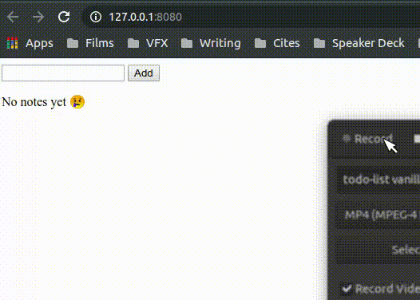

# Simple Todo List - Vanilla JS

This simple Todo list app implements:
1. Simple state management using vanilla JS, includes:
2. DOM and DOM Event
3. Function constructor
4. PubSub pattern
5. Proxy
6. JS Module
7. Simple JS component

Aimed to solve **hammercode challenge 2**
_Inspired from [css-tricks.com](https://css-tricks.com/build-a-state-management-system-with-vanilla-javascript/#article-header-id-9)_